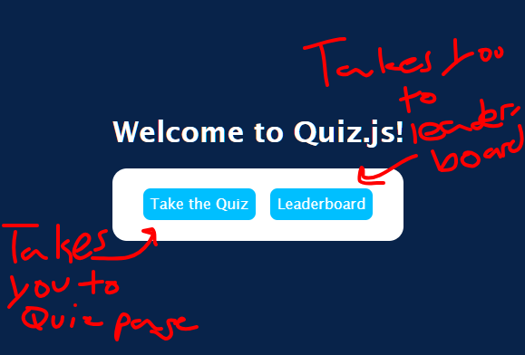
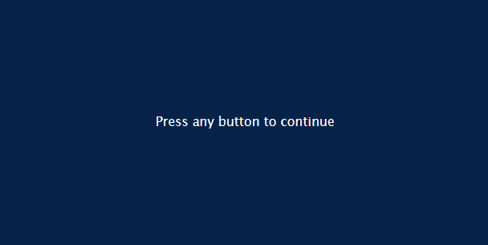
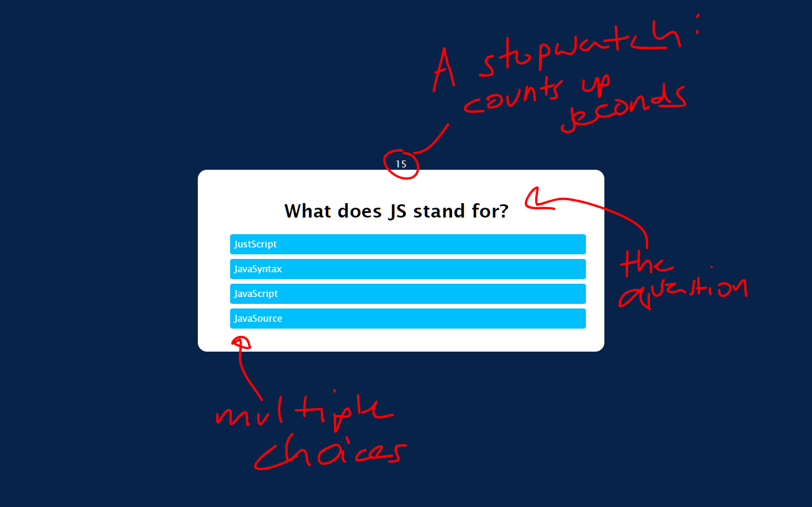
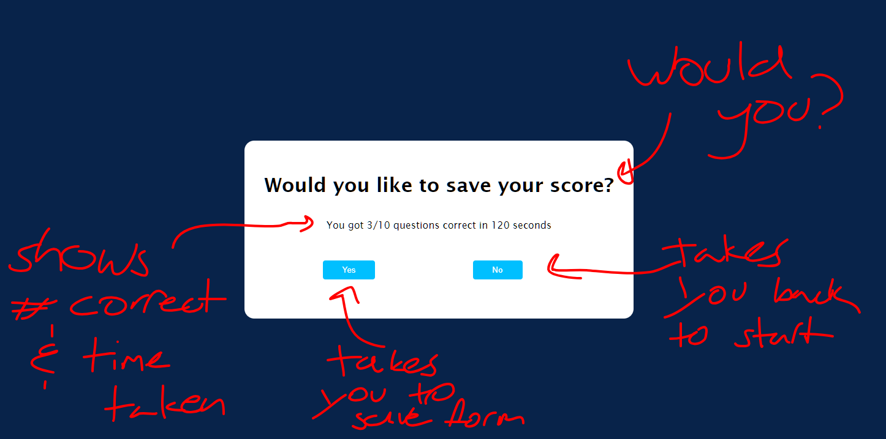
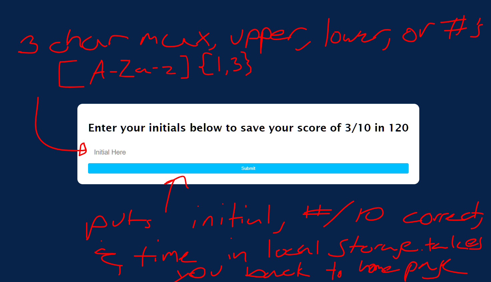
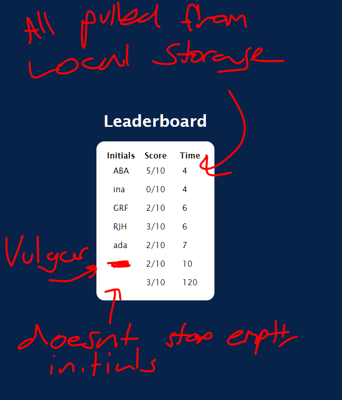

# Quiz.js

## Description

This project is a quiz in order to study some javascript essentials. Initially, I had planned to pull 10 random questions from a JSON file that contained 50 of them, but I could not get that to work, so I had to settle for just 10 questions in an array in the JS file. This project really challenged my knowledge of JavaScript and even computer science to an extent. This project allows me to compete against myself in terms of score/time to get better at JS. I wouldve liked those 50 questions for more of a challenge but oh well. 

## Installation

A simple git clone will do. No dependancies. Other than JS, CSS, and HTML

## Usage

From the home page you can either click "Take the Quiz" or "Leaderboards"

clicking take the quiz brings you to this page, where you can press any keyboard key to start the quiz. this leads to a countdown screen which says "Ready?" "Set?" "Go!"
(not pictured) after which, the quiz starts

once the quiz pops up, a timer will start, which counts every second since the quiz popped up. Answering a question shows the next question until all 10 have been answered, at which point you will be prompted to save your score

choosing yes on this screen takes you to a screen where you may enter your initials. choosing no takes you back to the homepage

here you may enter your initials to be saved in the leaderboard. After hitting submit it will be saved in local storage and you will be taken to the home page

this is where the results that are saved in local storage are stored. you have to click the back button to get back to the homepage

## License

Copyright 2023 Gavin Frazier

Permission is hereby granted, free of charge, to any person obtaining a copy of this software and associated documentation files (the “Software”), to deal in the Software without restriction, including without limitation the rights to use, copy, modify, merge, publish, distribute, sublicense, and/or sell copies of the Software, and to permit persons to whom the Software is furnished to do so, subject to the following conditions:

The above copyright notice and this permission notice shall be included in all copies or substantial portions of the Software.

THE SOFTWARE IS PROVIDED “AS IS”, WITHOUT WARRANTY OF ANY KIND, EXPRESS OR IMPLIED, INCLUDING BUT NOT LIMITED TO THE WARRANTIES OF MERCHANTABILITY, FITNESS FOR A PARTICULAR PURPOSE AND NONINFRINGEMENT. IN NO EVENT SHALL THE AUTHORS OR COPYRIGHT HOLDERS BE LIABLE FOR ANY CLAIM, DAMAGES OR OTHER LIABILITY, WHETHER IN AN ACTION OF CONTRACT, TORT OR OTHERWISE, ARISING FROM, OUT OF OR IN CONNECTION WITH THE SOFTWARE OR THE USE OR OTHER DEALINGS IN THE SOFTWARE.